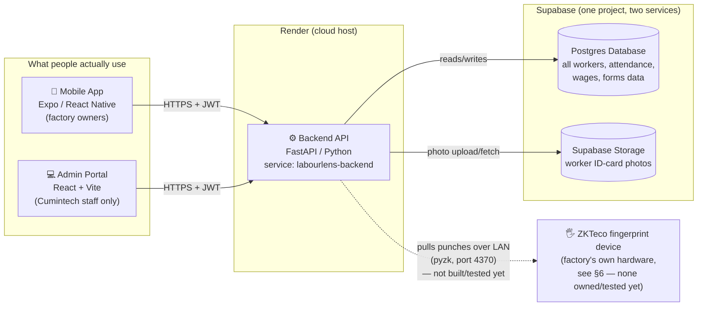
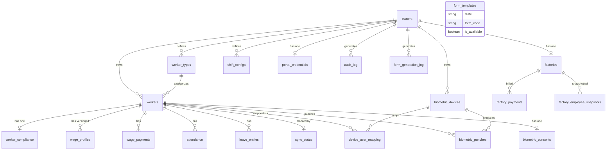
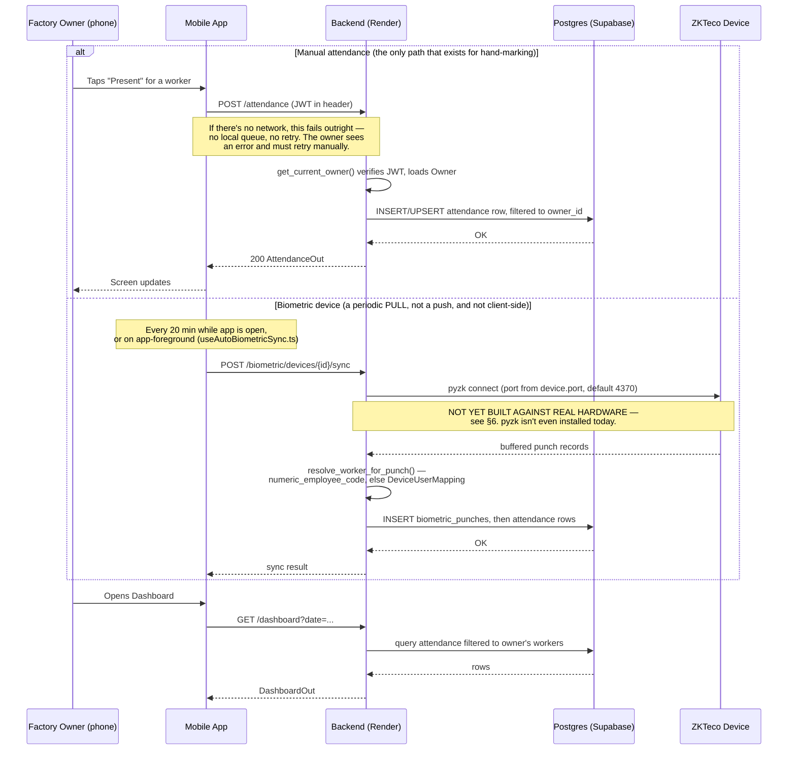
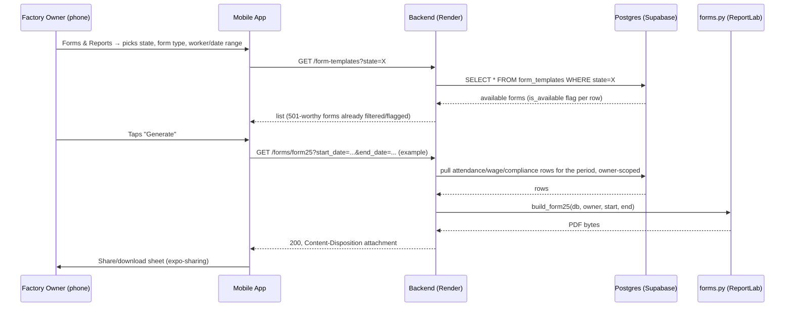
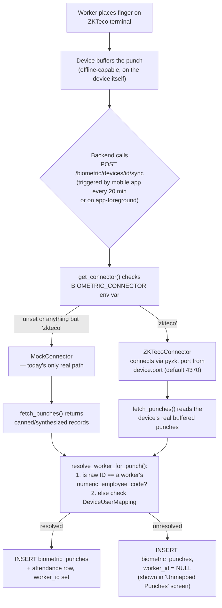
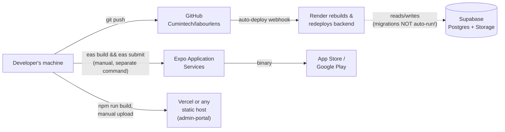

# LabourLens — Engineering Onboarding

> Written by reading the actual code (`backend/`, `mobile/`, `admin-portal/`) as it exists today, not from
> the planning docs alone. Every non-obvious claim below cites a file and line number. Where a planning
> doc (or a common assumption about this kind of app) disagrees with what the code actually does, that's
> called out in its own **⚠️ Correction** box rather than silently smoothed over — several such
> corrections exist in this document and matter for how you should think about the system.

---

## 1. System overview

**What problem this solves, in plain English:** Indian factories are legally required to keep detailed
paper registers of every worker they employ — who works there, what they're paid, when they're present,
and proof of statutory compliance (provident fund, insurance, minimum-wage records) that a labour
inspector can demand at any time. LabourLens replaces that paperwork with a phone app: a factory owner
registers workers (scanning their Aadhaar ID card to save typing), marks daily attendance, and generates
the exact government-mandated forms and wage slips as PDFs, pre-filled with real data, on demand.

**Who uses it:**
- **Factory owners** — the actual end users of the mobile app. Each owner's account is one factory; there
  is no concept of a worker having their own login (workers are records the owner manages, not app users).
- **Cumintech staff** (the company running LabourLens) — use a separate internal web tool, the admin
  portal, to see which factories are signed up and manage billing status. They never touch the mobile app.
- There is no third "admin" role inside a factory itself — see [§5 Auth & Roles](#5-auth--roles) for why
  this matters more than it sounds.

**Core workflow:** Sign up → register workers (Aadhaar scan or manual entry) → mark daily attendance
(manually, or pulled automatically from a fingerprint device if the factory has one) → generate statutory
forms/wage slips/ID cards/appointment letters as PDFs whenever needed, for a labour inspector, a bank, or
the worker themselves.

### Architecture



> **⚠️ Correction — no WhatsApp/Gupshup, no Railway.** If you've seen a spec or been told this app
> integrates with WhatsApp/Gupshup, or that the backend runs on Railway — neither is true in the current
> code. WhatsApp is listed in `PHASE2_BACKLOG.md:88` under a section explicitly headed *"None of these
> have been confirmed as real requirements"* — it's an idea, not a feature; zero code exists for it. The
> single "Railway" mention anywhere in the repo is a generic comment in a local secrets file
> (`backend/production.env:2`) listing it as a hypothetical alternative — every actual deployment
> reference (README, `eas.json`, `.env` files) points at Render. The backend runs on Render, full stop.

---

## 2. Tech stack & repo structure

### Stack

| Layer | Technology | Why |
|---|---|---|
| Mobile app | Expo (React Native) + TypeScript | Cross-platform (iOS/Android) from one codebase; Expo Application Services (EAS) handles native builds without hand-managing Xcode/Android Studio projects |
| Admin portal | React + Vite + TypeScript | A small internal SPA — Vite for fast dev/build, no need for a full framework since it's just a few list/detail pages calling the same backend |
| Backend API | FastAPI (Python) | Async-capable, auto-generates OpenAPI docs, plays well with Pydantic for request/response validation |
| ORM | SQLAlchemy 2.0 (`Mapped`/`mapped_column` style) | Standard Python ORM; this codebase uses it purely for column mapping — see §3, there are **zero** `relationship()` declarations anywhere, every join is a manual `db.query(...).filter(...)` |
| Database | Postgres, hosted by **Supabase** | Managed Postgres with a generous free tier; Supabase also conveniently bundles file storage under the same project |
| File storage | **Supabase Storage** (same project as the DB) | Worker ID-card photos live here, not in Postgres — see `backend/photo_storage.py:6-11`: Render's disk is wiped on every deploy, so anything meant to persist can't live on the backend's own filesystem |
| Migrations | Alembic | 7 linear migrations, no branches — see §3 |
| Auth | Hand-rolled JWT (PyJWT) + bcrypt | No third-party auth provider; a single HS256-signed token per login, see §5 |
| PDF generation | ReportLab | Every statutory form, wage slip, ID card, and appointment letter is built server-side as a real PDF |
| OCR | EasyOCR (deferred-loaded — see below) | Reads name/DOB/address off a photographed Aadhaar card |
| Biometric device driver | `pyzk` (**not currently installed** — see §6) | Talks to ZKTeco fingerprint terminals |
| Mobile build/release | Expo Application Services (EAS) | `eas build`/`eas submit`, three profiles (development/preview/production) — see §8 |
| Backend hosting | **Render** | `labourlens-backend.onrender.com` |
| Admin portal hosting | Vite static build, **documented as intended for Vercel** (or any static host) | No deploy-config file is actually committed for it — see §8's honesty note |

### Repo layout

```
labourlens/
├── mobile/                 # The Expo/React Native app (factory owners)
│   ├── app.json            # Expo config: name, bundle ID, permissions, plugins
│   ├── eas.json             # EAS build profiles (dev/preview/production)
│   ├── App.tsx              # Entry point — wraps navigation in AuthProvider/AppLockProvider/ErrorBoundary
│   └── src/
│       ├── api/client.ts    # The ENTIRE backend API surface — every fetch call lives in this one file
│       ├── screens/         # One file per full-page screen (largest folder)
│       ├── components/      # Shared UI: cards, pickers, skeletons, error states
│       ├── context/         # AuthContext (session/token), AppLockContext (local PIN lock)
│       ├── hooks/            # useAutoBiometricSync (see §6/§7 — NOT an offline queue)
│       ├── navigation/       # RootNavigator, MainTabs, AppDrawer
│       └── theme.ts, indianStates.ts, pdfShare.ts, workerLabel.ts  # small shared helpers/constants
├── backend/                 # FastAPI server — the only thing either app talks to
│   ├── main.py               # Most routes live here (57 of 78 — see §4)
│   ├── models.py              # All 22 SQLAlchemy tables (§3)
│   ├── auth.py / admin_auth.py # Two separate JWT systems (§5)
│   ├── biometric.py / biometric_api.py / biometric_sync.py  # ZKTeco integration (§6)
│   ├── sync_worker.py          # Playwright automation that syncs workers to an external Labour Portal
│   ├── forms.py                 # Every PDF-building function (statutory forms, wage slip, ID card, letter)
│   ├── photo_storage.py          # Supabase Storage upload/fetch for worker photos
│   ├── privacy_policy.py          # Single source of truth for the Privacy Policy (served 2 ways — see §9)
│   ├── admin.py                    # Admin-portal-only routes
│   ├── alembic/versions/            # 7 migrations, linear history
│   └── requirements.txt              # Note: pyzk is commented out (§6)
├── admin-portal/              # Internal Vite/React SPA for Cumintech staff
│   └── src/pages/               # FactoryListPage, LoginPage, etc.
├── BUILD_PLAN.md, SPEC.md, PHASE2_BACKLOG.md, PHASE3_STATUTORY_FORMS_PLAN.md, DATA_MODEL.md
│                                  # Planning docs — several are now STALE relative to the code; see §9
└── README.md                       # The most up-to-date narrative account of what's been built
```

### Environment variables / local setup

None of the real secrets are committed — every real `.env` is gitignored; only `.env.example` files are
tracked. What each piece needs:

**Backend** (`backend/.env`, based on `backend/.env.example`):
| Variable | Purpose |
|---|---|
| `DATABASE_URL` | Postgres connection string. Local dev commonly uses `sqlite:///./dev.db` instead — SQLite works fine for local development even though production is Postgres/Supabase. |
| `JWT_SECRET` | Signs owner login tokens |
| `ENCRYPTION_KEY` | A Fernet key — encrypts Aadhaar numbers, bank account numbers, addresses (`EncryptedString` columns, §3) |
| `SUPABASE_URL`, `SUPABASE_SERVICE_ROLE_KEY` | Only needed for the worker-photo upload feature to actually work — see `backend/photo_storage.py:13-23` |
| `PHOTO_STORAGE_ALLOW_LOCAL_FALLBACK=true` + `PHOTO_STORAGE_DIR` | Local-dev-only opt-in to save photos to local disk instead of Supabase Storage — **never** set this on Render, since its disk doesn't persist across deploys |

Local dev, quoted directly from the repo's own documentation:
1. Python 3.12.7 (`backend/runtime.txt`) — `pip install -r requirements.txt`
2. Copy `.env.example` → `.env`, fill in the three required vars above
3. Run migrations (Alembic is configured; no in-repo doc names the exact command, but it's the standard `alembic upgrade head`)
4. Start it reachable on your LAN so a phone can hit it too (`mobile/README.md:31`):
   ```bash
   uvicorn main:app --host 0.0.0.0 --port 8010
   ```

**Mobile**, quoted from `mobile/README.md:22-39`:
1. Install Expo Go (Play Store / App Store)
2. Find your computer's LAN IP (`ipconfig` on Windows → "IPv4 Address")
3. Copy `.env.example` → `.env`, set `EXPO_PUBLIC_API_URL=http://<your-LAN-IP>:8010` — **not** `localhost`,
   since your phone is a separate device on the network
4. Make sure the backend from step 4 above is actually running and reachable at that IP
5. `npm install`, then `npx expo start`, then scan the QR code with Expo Go

**Admin portal**, quoted from `admin-portal/README.md:5-13`:
```bash
npm install
cp .env.local.example .env.local   # set VITE_API_URL, e.g. http://localhost:8010
npm run dev
```
Log in with an admin account created via `backend/seed_admin.py` (or `ADMIN_EMAIL`/`ADMIN_PASSWORD` env vars).

---

## 3. Data model

**Exact count, verified by reading every class in `backend/models.py`: 22 tables.** (Verified twice —
once by a full-file read, once by an independent `grep -n "^class "` count. Both agree on 22.)

### How multi-tenancy actually works — read this before touching any query

> **⚠️ This is the single most important thing to understand before writing your first query.**
> There is **no database-level tenant isolation** — no Postgres Row-Level Security (RLS), no
> tenant-scoped connection, nothing enforced by the schema itself. A repo-wide search for RLS-adjacent
> Postgres constructs (`ROW LEVEL SECURITY`, `SET LOCAL`, `current_setting`) returns **zero matches**.
>
> Instead, isolation is a **convention enforced by hand, in every single backend route**: every query
> that touches tenant data must explicitly add `.filter(Model.owner_id == owner.id)` (or filter
> transitively through a `worker_id`/`factory_id` FK that itself belongs to that owner). The
> `get_current_owner` dependency's own comment (`backend/auth.py:46-48`) states this as the rule
> outright: *"this is the multi-tenant boundary. Every query downstream must filter by this owner's id,
> never trust an owner_id from the request body."* There are 32 occurrences of this exact filter pattern
> across `main.py` alone.
>
> **What this means in practice**: if you add a new query and forget the owner filter, nothing at the
> database level will stop it — you will leak one factory's data to another. This is the #1 thing to get
> a second pair of eyes on in any PR touching a new table.

### Tables

Grouped by subsystem (file order preserved within each group; line numbers are `backend/models.py`).

**Core tenant + worker records**
| Table | Purpose | Key columns | Notable |
|---|---|---|---|
| `owners` (`Owner`, L11) | One row per factory-owner account — the tenant root | `mobile` (unique), `password_hash`, `factory_name`, `factory_address`, `state`, `industry`, `consent_given_at`, `deleted_at` | `deleted_at` supports account deletion (Apple Guideline 5.1.1(v)) without cascading — see §9 |
| `workers` (`Worker`, L75) | The core employee register | `owner_id` FK, `aadhaar_last4` + `aadhaar_encrypted`, `current_address`/`native_address`/`current_district`/`native_district`/`bank_account_number` (all `EncryptedString`), `bank_ifsc` (**plaintext — see §9 tech debt**), `numeric_employee_code`, `photo_key`, `status` | Unique on `(owner_id, numeric_employee_code)` |
| `worker_types` (`WorkerType`, L52) | Factory-defined pay categories (e.g. "Skilled") with default rates | `owner_id`, `name`, `default_rate_type`, `default_rate` | Unique on `(owner_id, name)` |
| `worker_compliance` (`WorkerCompliance`, L229) | Form 12 fields — one row per worker | `worker_id` (unique), `designation_or_nature_of_work`, `epf_uan_no`, `esic_no`, `category` (adult/young_person), `date_of_joining` | |

**Attendance & leave**
| Table | Purpose | Key columns | Notable |
|---|---|---|---|
| `attendance` (`Attendance`, L124) | Present/absent per worker per date per shift slot | `worker_id`, `date`, `slot`, `status`, `overtime_hours`, `source` ("manual"/"biometric") | Unique on `(worker_id, date, slot)`. No `owner_id` — tenant-scoped transitively via `worker_id`. `slot` is a free string keyed against the owner's own `shift_configs`, **not** a fixed AM/PM/Evening enum (an earlier design) |
| `shift_configs` (`ShiftConfig`, L207) | Owner-configurable shift definitions | `owner_id`, `slot_key`, `label`, `start_time`/`end_time` | Replaces a once-hardcoded 3-slot model |
| `leave_entries` (`LeaveEntry`, L285) | Leave records feeding Form 15's leave-wage columns | `worker_id`, `leave_type`, `date_from`/`date_to`, `wages_paid` | |

**Wages & payroll**
| Table | Purpose | Key columns | Notable |
|---|---|---|---|
| `wage_profiles` (`WageProfile`, L256) | A worker's pay rate, **versioned** | `worker_id`, `rate_type`, `basic`, `hra`/`da`/`other_allowances`, `pf_rate`/`esi_rate`, `effective_from` | Append-only by design — no unique constraint, multiple rows per worker are intentional (a past wage slip must reflect that period's rate) |
| `wage_payments` (`WagePayment`, L307) | The actual fact that a payment happened | `worker_id`, `month`, `year`, `date_of_payment`, `payment_reference` | Unique on `(worker_id, month, year)` |

**Statutory forms**
| Table | Purpose | Key columns | Notable |
|---|---|---|---|
| `form_templates` (`FormTemplate`, L526) | Which form types are available per state — see deep-dive below | `state`, `form_code`, `label`, `is_available` | **Not tenant-scoped** — reference data, unique on `(state, form_code)` |
| `form_generation_log` (`FormGenerationLog`, L403) | Audit trail of every form generated/emailed | `owner_id`, `worker_id` (nullable), `form_code`, `action` | |

**Biometric device integration** (see §6 for the full mechanism)
| Table | Purpose | Key columns | Notable |
|---|---|---|---|
| `biometric_devices` (`BiometricDevice`, L424) | One row per fingerprint terminal | `owner_id`, `ip_address`, `port` (default 4370), `force_udp`, `comm_password` | |
| `device_user_mapping` (`DeviceUserMapping`, L460) | Fallback map: device's raw enrollment ID → worker | `device_id`, `device_user_id`, `worker_id` | Unique on `(device_id, device_user_id)` — a raw ID is only unique per-device |
| `biometric_punches` (`BiometricPunch`, L479) | Raw punch events pulled from a device (or mock) | `device_id`, `worker_id` (nullable — unmapped punches are kept, not dropped), `raw_device_user_id`, `timestamp` | Unique on `(device_id, raw_device_user_id, timestamp)` — re-pulling the same batch is a safe no-op |
| `biometric_consents` (`BiometricConsent`, L508) | DPDP-Act-mandated consent record, one per worker | `worker_id` (unique), `notice_text`, `consented_by`, `consented_at` | `notice_text` is free text the owner types per worker — **not** a fixed reviewed disclosure |

**Labour Portal sync** (external system — see §9's tech-debt note, this is not the biometric sync)
| Table | Purpose | Key columns | Notable |
|---|---|---|---|
| `sync_status` (`SyncStatus`, L156) | Tracks per-worker sync state to an external Labour Portal | `worker_id`, `action`, `state`, `attempts`, `last_error` | |
| `portal_credentials` (`PortalCredential`, L173) | One owner's login for the external Portal | `owner_id` (unique), `portal_username`/`portal_password` (`EncryptedString`) | |
| `audit_log` (`AuditLog`, L191) | Append-only activate/deactivate log | `owner_id`, `worker_id`, `action`, `reason` | |

**Admin / billing** (used only by the admin portal, not the mobile app)
| Table | Purpose | Key columns | Notable |
|---|---|---|---|
| `admin_user` (`AdminUser`, L391) | Cumintech staff login — completely separate from `owners` | `email` (unique), `password_hash` | No FK to anything — independent of the tenant tree. No roles table (§5) |
| `factories` (`Factory`, L330) | Billing/status overlay, one auto-created per `Owner` at signup | `owner_id` (unique), `status` ("trial" default), `plan_tier` | |
| `factory_payments` (`FactoryPayment`, L355) | Manually recorded invoicing | `factory_id`, `amount`, `due_date`, `status` | |
| `factory_employee_snapshots` (`FactoryEmployeeSnapshot`, L375) | Monthly headcount snapshot for the admin dashboard trend | `factory_id`, `month` (e.g. `"2026-09"`), `active_employee_count` | Populated by a scheduled job — a snapshot, not a live join |

### ER diagram


*(`form_templates` and `admin_user` are intentionally excluded from the relationship lines above — neither
has any FK to the `owners` tenant tree; they're reference data and a fully separate login system respectively.)*

### The `form_templates` design, explained concretely

This table exists because statutory forms differ by Indian state, and the app needs to know which forms
to offer for a given factory without hardcoding that logic per-screen. It's keyed on `(state, form_code)`,
seeded once via migration `83fef8a9e1ba_form_templates_and_owner_state.py` with exactly these 9 rows:

| state | form_code | label | is_available |
|---|---|---|---|
| Tamil Nadu | attendance | Attendance Report (all workers) | ✅ |
| Tamil Nadu | form25 | Form 25 — Muster Roll (all workers) | ✅ |
| Tamil Nadu | form25b | Form 25-B — Time Card | ✅ |
| Tamil Nadu | form12 | Form 12 — Register of Adult Workers | ✅ |
| Tamil Nadu | form15 | Form 15 — Wage Register (all workers) | ✅ |
| Tamil Nadu | wageslip | Wage Slip | ✅ |
| Karnataka | form11 | Form 11 — Register of Employees (coming soon) | ❌ |
| Karnataka | form14 | Form 14/15 — Wage Register (coming soon) | ❌ |
| Karnataka | form22 | Form 22 — Register of Wages (coming soon) | ❌ |

`GET /form-templates?state=X` (`main.py:1383`) does a flat `WHERE state = X` — no owner filter, since this
is reference data. Requesting a form whose row has `is_available=False` returns `501 Not Implemented`
(`main.py:1445`) rather than silently failing. Two more "forms" — ID Card and Appointment Letter — aren't
state-specific at all, so they're appended in Python rather than stored as rows (`main.py:1406-1409`).

### Migration history

7 migrations, one linear chain (no branches):
`8280d5c403d5` (initial schema, 13 tables) → `13e08406c163` (admin portal, +4) → `a1348acb7952`
(biometric layer, +4) → `83fef8a9e1ba` (form templates + `owners.state`, +1) → `e15fb0d97995`
(`owners.industry`) → `f2a9c7d13e4b` (`workers.photo_key`) → `b7c14e2a9f60` (`owners.deleted_at`, current head).
13+4+4+1 = 22 tables created across migrations, matching `models.py` exactly — **no drift found between
the migrations and the current models.**

---

## 4. API reference

**Exact total: 78 endpoints** (57 in `main.py`, 14 in `biometric_api.py`, 7 in `admin.py`) — verified via
grep across every `backend/*.py` file for route decorators, confirmed no duplicates and no dead routes.

### Public / unauthenticated (3)
| Method & Path | Purpose |
|---|---|
| `GET /health` | Liveness check |
| `GET /privacy-policy` | Public HTML privacy policy (the URL Play Console/App Store Connect require) |
| `GET /privacy-policy.json` | Same content, fetched by the mobile app's in-app screen |

### Auth & Account (5)
| Method & Path | Purpose |
|---|---|
| `POST /owners/signup` | Create account; also seeds default shifts, worker types, and a `Factory` row |
| `POST /owners/login` | Login |
| `GET /owners/me` | Current owner profile + plan/trial status |
| `PUT /owners/me/factory-profile` | Update factory name/address/licence/state/industry |
| `DELETE /owners/me` | Soft-delete: invalidates login, does **not** cascade-delete statutory records |

### Workers (20)
Registration, OCR, photo upload, ID card/appointment letter generation, deactivation, compliance records,
worker types, employee codes, and biometric consent. Full list: `POST/GET /workers`, `GET
/workers/missing-compliance`, `GET/PATCH /workers/{id}`, `POST /workers/{id}/photo`, `POST
/workers/{id}/id-card`, `POST /workers/{id}/appointment-letter`, `PATCH /workers/{id}/deactivate`,
`POST/GET/PUT /workers/{id}/compliance`, `GET/POST/PUT/DELETE /worker-types[/{id}]`, `PUT
/workers/{id}/worker-type`, `POST /workers/{id}/employee-code`, `GET/POST
/workers/{id}/biometric-consent`.

### Attendance, Leave & Shift Config (11)
`GET/POST/PUT/DELETE /shift-configs[/{id}]`, `POST /attendance`, `GET /attendance`, `GET
/workers/{id}/attendance-month`, `POST/GET /workers/{id}/leave`, `GET /leave`, `DELETE /leave/{id}`.

### Wage / Payroll (7)
`POST/GET /workers/{id}/wage-profile`, `GET /workers/{id}/wage-profile/history`, `POST
/workers/{id}/wage-payment`, `GET /workers/{id}/wage-computation`, `GET /wage-summary`, `GET
/wage-summary/daily`.

### Labour Portal Sync (3) — *distinct from biometric sync, see §9*
`POST /portal-credentials`, `POST /sync/run`, `GET /sync-status`.

### Statutory Forms & Reports (10)
`GET /form-templates`, `GET /forms/form25`, `GET /forms/form25b`, `GET /forms/form12[/{worker_id}]`, `GET
/forms/form15`, `GET /forms/wageslip`, `POST /forms/{form_code}/email`, `GET /reports/attendance`, `POST
/reports/attendance/email`.

### Biometric Devices (11)
`POST/GET /biometric/devices`, `PATCH /biometric/devices/{id}`, `POST
/biometric/devices/{id}/sync`, `GET/POST/DELETE /biometric/device-mappings[/{id}]`, `GET
/biometric/unmapped-punches`, `POST /biometric/unmapped-punches/{id}/resolve`, `GET /biometric/health`,
`POST /biometric/devices/{id}/verify-punch`.

### Dashboard (1)
`GET /dashboard` — daily attendance summary.

### Admin Portal (7)
`POST /admin/login`, `GET /admin/dashboard`, `GET/PATCH /admin/factories[/{id}]`, `POST/PATCH
/admin/factories/{id}/payments[/{id}]`.

Every route above except signup/login/health/privacy-policy/admin-login requires
`Depends(get_current_owner)` or `Depends(get_current_admin)` — see §5 for exactly what that means.

### Sequence: a worker punch reaching the owner's dashboard

> **⚠️ Correction — this is NOT an offline-queue flow.** The assumption that punch data is captured
> offline and queued for later sync **does not match this codebase**. There is no offline queue anywhere
> in `mobile/src` (confirmed by exhaustive grep — zero matches for "queue", "offline", "NetInfo"). Below
> is what actually happens for **both** the manual-marking path and the biometric-device path.



### Sequence: statutory form generation



---

## 5. Auth & roles

**Token issuance** (`backend/auth.py`): a JWT signed with HS256, containing exactly two claims —
`owner_id` and `exp`. Expiry is a flat **7 days** (`JWT_EXPIRY_HOURS = 24 * 7`, `auth.py:20`). Passwords
are bcrypt-hashed.

> **⚠️ Correction — there is no refresh-token mechanism.** The code says so itself
> (`backend/auth.py:1-4`): *"No refresh-token flow yet (Day 1 scope is auth existing at all, not a full
> session-lifecycle design) — tokens are short-lived and re-login is cheap for this app's usage pattern."*
> A token simply expires after 7 days and the owner must log in again from scratch. If you're asked to
> "fix the token refresh bug," there is no refresh flow to fix — you'd be building one from nothing.

**Verification** (`get_current_owner`, `auth.py:42-69`): decodes the token, requires the `owner_id` claim
to be present, loads the `Owner` row, and explicitly rejects it if `owner.deleted_at is not None` — so a
still-unexpired token from a deleted account is refused, not just blocked at the login screen.

**Mobile storage**: the JWT and owner profile are stored in plain **AsyncStorage** (`AuthContext.tsx:1,
5-6`, keys `labourlens_token`/`labourlens_owner`) — **not** Expo SecureStore. Every authenticated API call
manually attaches `Authorization: Bearer ${token}`; there's no shared HTTP-client interceptor doing this
automatically (`client.ts` has no axios-style instance — each function sets the header itself).

**401 handling**: a module-level `unauthorizedHandler` in `client.ts` is registered to `AuthContext`'s
`logout` function on mount. Any single 401 from any endpoint immediately clears storage and resets
`token`/`owner` to `null`, which (via navigation gated on `token`) silently drops the user back to Login —
no "your session expired" message, and any unsaved input in whatever screen they were on is lost.

### Roles

> **⚠️ Correction — there is no fine-grained role system.** No "manager" vs "supervisor," no permissions
> table, no `is_admin` flag on any shared table. There are exactly **two, completely separate, non-overlapping
> login systems**:

| | Owner | AdminUser |
|---|---|---|
| Table | `owners` | `admin_user` |
| Who | A factory owner | Cumintech staff (platform operator) |
| Auth dependency | `get_current_owner` | `get_current_admin` |
| Token distinguishing claim | has `owner_id`, no `type` claim | has `type: "admin"` and `admin_id` |
| Token expiry | 7 days | 12 hours |
| Created via | `/owners/signup` (public) | **No API route at all** — only `backend/seed_admin.py`, run manually |
| Can access | `/workers/*`, `/attendance`, `/forms/*`, etc. | `/admin/*` only |

The two systems are cryptographically distinguishable even though they share the same `JWT_SECRET`: an
owner's token has no `type` claim, so `get_current_admin`'s check `payload.get("type") == "admin"` fails
for it; an admin's token has no `owner_id` claim, so `get_current_owner` fails for it too
(`admin_auth.py`'s own docstring states this explicitly). There is no role that can do "some but not all"
of what an Owner can do — an Owner account has full access to everything in their own tenant, and nothing
outside it.

---

## 6. Biometric integration (ZKTeco)

**Current state — read this first:** No physical ZKTeco device has ever been purchased or connected to
this system. This isn't an inference — the code says so in multiple places:

- `backend/biometric.py:1-14` (module docstring): *"MockConnector (no hardware needed, used for all of
  today's development and every automated test) and ZKTecoConnector (the real pyzk-backed implementation,
  structurally complete against pyzk's documented API but untested against a physical unit — none is
  available yet)."*
- `backend/requirements.txt:50-57`: `pyzk` is **commented out**, with the note: *"Uncomment and pip install
  once a physical ZKTeco unit is available to test against, then set BIOMETRIC_CONNECTOR=zkteco."*
- `mobile/src/hooks/useAutoBiometricSync.ts:16-22` (verbatim): *"no physical ZKTeco device exists yet for
  this project (everything runs against the mock connector — see biometric.py), and a cloud-hosted backend
  (Render) generally can't reach a device sitting on a factory's own local network without a VPN/tunnel of
  some kind. That part of the request needs a real device and real network topology to build against, not
  something to fake here."*

**What this means for testing today**: everything you exercise — `POST /biometric/devices/{id}/sync`, the
unmapped-punch resolution flow, the "Sync now" button in the app — runs against `MockConnector`, which
returns canned/synthesized punch data, never a real device. The real-device code path
(`ZKTecoConnector`) is complete and reviewed but has zero real-world runtime.

### How it's meant to work once a device exists



**Connection mechanics** (`backend/biometric.py`): TCP by default, UDP only if `BiometricDevice.force_udp`
is set; `disable_device()` before reading, `enable_device()`/`disconnect()` after, both in a `finally`
block so a mid-read failure doesn't leave the terminal in a bad state.

**Mapping a punch to a worker** (`biometric_sync.py:39-63`), in the order actually checked:
1. First, look for a `DeviceUserMapping` row for `(device_id, raw_device_user_id)`.
2. If none exists, fall back to treating the raw ID as if it *is* the worker's own
   `numeric_employee_code` directly (the "preferred" enrollment convention — enroll the worker on the
   terminal using their existing employee code, and no mapping row is ever needed).

---

## 7. Offline sync

> **⚠️ Correction — this section is short because the feature doesn't exist.** If you were told LabourLens
> has offline attendance sync, that is not accurate for the current codebase. This was checked
> exhaustively: a case-insensitive grep of the entire `mobile/src` tree for `offline`, `NetInfo`, `queue`,
> and `pending` returns **zero matches** for the first three, and the one `pending` hit is unrelated UI
> copy about unmapped biometric punches. There is no `@react-native-community/netinfo` dependency in
> `package.json` at all.

**What actually happens today**: `markAttendance()` (`client.ts:371-384`) is a direct `fetch` POST. If the
phone has no connectivity, the request fails and the owner sees an error (`ErrorState` with a manual
Retry button, per the app's general error-handling pattern) — there is no local write buffer, so the data
is simply not saved until the owner notices and retries by hand.

**What "sync" *does* mean in this codebase**: `useAutoBiometricSync.ts` is a periodic **pull**, not an
offline write queue — every 20 minutes (or on app-foreground) the app tells the backend to go fetch
whatever a fingerprint terminal has buffered (see §6). This is a completely different mechanism from "the
user's own phone remembers writes made while offline" — that second thing does not exist.

**Known gap, stated plainly for planning purposes**: a factory floor with poor signal will lose any
attendance mark the owner makes during a dead zone, with no automatic recovery — this is a real,
un-mitigated limitation of the current app, not a subtle edge case.

---

## 8. Deployment & infrastructure

| Piece | Runs on | How a change gets there |
|---|---|---|
| Backend API | **Render** (`labourlens-backend.onrender.com`) | `git push` to the branch Render watches → Render auto-builds and redeploys. No CI pipeline runs first (see below) — a broken push goes straight to production. |
| Database + file storage | **Supabase** (Postgres + Storage, one project) | Schema changes go through Alembic migrations, run manually against the production `DATABASE_URL` — Render does **not** auto-run migrations on deploy. Forgetting this before a deploy that changes the schema has caused a real outage before (see §9). |
| Mobile app | **Expo Application Services (EAS)** | A developer runs `eas build --profile production`, then `eas submit`, manually. Three profiles exist (`development`, `preview`, `production`) — all three point at the same Render backend URL; there is no separate staging backend. |
| Admin portal | Documented as intended for **Vercel or any static host** (`npm run build` → `dist/`) | No deploy-config file (`vercel.json`, etc.) is actually committed — deployment, if it has happened, is via Vercel's own dashboard import, not an in-repo pipeline. |

> **⚠️ Honesty note — there is no CI/CD.** A repo-wide search for `.github/workflows/` found matches only
> inside third-party `node_modules` packages, never in this project's own code. **There is no automated
> test run, lint check, or build gate before anything reaches production.** Every deploy is a human running
> a command (`git push`, `eas build`, or a manual static-site upload).



---

## 9. Current state & in-flight work

### Fully built and stable
- Owner signup/login, worker registration (Aadhaar OCR + manual), attendance marking, dashboard
- All 7 PDF documents: Form 25, Form 25-B, Form 12, Form 15, Wage Slip, ID Card, Appointment Letter — every
  `build_*` function in `forms.py` is real and working, none are stubs
- State-aware Forms & Reports (Tamil Nadu fully available; Karnataka intentionally stubbed, see below)
- Account deletion, hosted Privacy Policy page, Android target-SDK compliance (all recent App Store/Play
  Store readiness work)
- The 11-item UI/UX overhaul plan (`cheeky-leaping-star.md`) — spot-checked and substantially complete;
  one item (the date picker) was solved with a different implementation than originally planned (a fully
  custom picker component, after native-picker testing on real devices proved unreliable)

### Deliberately incomplete (not a bug — don't "fix" these without asking)
- **Karnataka statutory forms** — 3 `form_templates` rows exist with `is_available=False` and
  "(coming soon)" labels. This is intentional scaffolding for a state nobody's built real forms for yet,
  not a broken feature.
- **ZKTeco real-hardware support** (§6) — code is complete, `pyzk` is deliberately left uninstalled until
  a real device is available to test against.
- **Offline sync** (§7) — genuinely doesn't exist, not deferred-but-half-built.
- **JWT refresh flow** (§5) — genuinely doesn't exist; explicitly scoped out on Day 1.

### Known technical debt (be aware before you "clean up" the wrong thing)
- **`Worker.bank_ifsc` is plaintext** while every other bank/address field on the same table
  (`bank_account_number`, addresses, Aadhaar) is encrypted. This looks like an oversight, not a deliberate
  choice — no comment explains why IFSC specifically was left out.
- **`sync_worker.py` sends full worker PII to an external system automatically.** For every pending
  create/deactivate action, `PortalAutomation` sends the worker's real name and **decrypted full Aadhaar
  number** (not just the last 4 digits) to an external "Labour Portal," with `PORTAL_BASE_URL` pointing at
  a mock Test Portal in development and a real third-party system in production — with no read-back/
  verification step. This is a real, active data flow, not a hypothetical.
- **The Privacy Policy doesn't disclose everything the app actually does.** `backend/privacy_policy.py`'s
  content mentions Aadhaar and photos, but a full-text search of it for "biometric," "fingerprint,"
  "Portal," and "bank"/"IFSC" returns zero matches. The fully-built biometric-punch subsystem, bank
  account/IFSC collection, and the Labour Portal PII transmission above are **not disclosed** in the one
  canonical policy document. This is worth raising, not silently living with.
- **App rename to "Labour Code i360" has not been applied to the code.** A decision may have been made,
  but a repo-wide search for "Labour Code i360"/"LabourCode"/"i360" found zero matches — the app is still
  "Labour Lens" everywhere (display name, bundle ID `com.labourlens.app`, every in-app string, and even the
  Privacy Policy's HTML `<title>`). If you're picking up this rename, it's a from-scratch text-replacement
  task, not something partially started.

### Where the planning docs are stale (don't trust these blindly)
- **`DATA_MODEL.md`** documents only 5 tables from "Day 1." The real schema has 22. It was never updated
  through the statutory-forms, biometric, or admin-portal build phases. Use §3 of this document instead.
- **`PHASE3_STATUTORY_FORMS_PLAN.md`** still says "**Not yet started**" at the top of the file, but every
  form it describes has since been fully built. The header was simply never updated on completion.
- **`BUILD_PLAN.md`** is the one planning doc that *does* keep an honest status log as work completed — a
  more reliable historical record than the other three.

---

## 10. Glossary

| Term | Plain-English meaning |
|---|---|
| **Aadhaar** | India's 12-digit national ID number. Only the last 4 digits are ever shown on screen or in a PDF — the full number is encrypted at rest (except the one automatic transmission to the Labour Portal, noted above). |
| **UAN** | Universal Account Number — a worker's permanent Provident Fund (retirement savings) identifier, portable between employers. |
| **ESIC** | Employees' State Insurance Corporation number — ties a worker to India's government health-insurance scheme for low-wage workers. |
| **Form 12** | A statutory register of every adult/young worker ever employed at a factory — never edited to remove someone who's left, only marked with an exit date. |
| **Form 15** | The statutory wage-and-leave register — basic pay, allowances, deductions, and leave wages per worker per month. |
| **Form 25 / 25-B** | The "muster roll" (attendance register) and its per-worker time-card variant. |
| **Wage slip** | A single worker's payslip for a period — what they were paid and what was deducted. |
| **Muster roll** | The general term for an attendance register — Form 25 is Tamil Nadu's specific version of one. |
| **Punch** | One fingerprint-scan event at a biometric terminal (a clock-in or clock-out). |
| **Punch source** | Whether an attendance record came from a human tapping "Present" (`"manual"`) or a biometric device pull (`"biometric"`) — tracked on every `attendance` row. |
| **Multi-tenant** | Many separate factory owners share one database and one backend, with isolation enforced by application code, not the database itself (see §3). |
| **DPDP Act** | India's Digital Personal Data Protection Act — the reason a worker's biometric consent is captured as a real, timestamped record, not just a checkbox nobody stores. |
| **JWT** | JSON Web Token — the signed, tamper-evident string the app carries after login, proving who's making each request without sending a password every time. |
| **RLS (Row-Level Security)** | A Postgres feature that would enforce tenant isolation *inside the database itself*. LabourLens does **not** use this — see §3's warning. |
